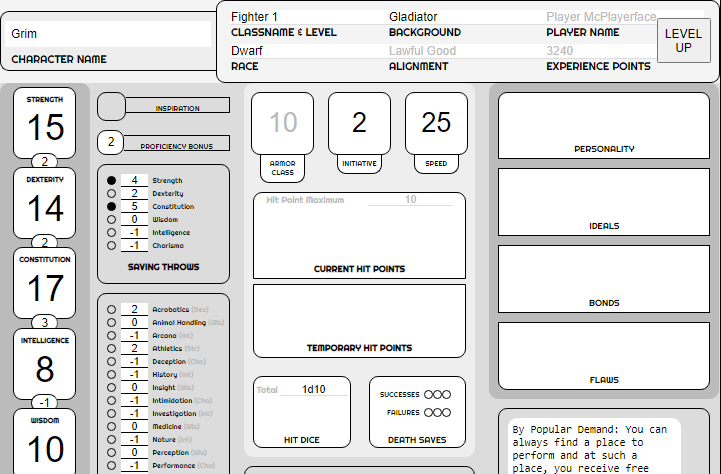

  
  # RPG Sheet

  ## Description

RPG Sheet marked my initial venture into the world of TypeScript and React. This project showcases my proficiency in Tailwind CSS and my capability to design intricate forms that serve practical purposes. Initially, I developed RPG Sheet to streamline the creation of core D&D 5e characters for my personal use and to maintain an editable, browser-based HTML character sheet.

  ## Table of Contents

  - [Installation](#installation)
  - [Usage](#usage)
  - [License](#license)
  - [Questions](#questions)

  ## Installation

  npm i - npm run dev

  ## Usage

  Just use the link: scicluna.github.io/rpgv2/
  

  ## License

  This application is covered under the MIT license. Read more at [License: MIT](https://opensource.org/licenses/MIT)

  ## Questions

  1. Where can I find your github so that I can view your other projects? https://github.com/scicluna

  2. What email address should I use to contact you regarding further opportunities or questions? sciclunajl@gmail.com
